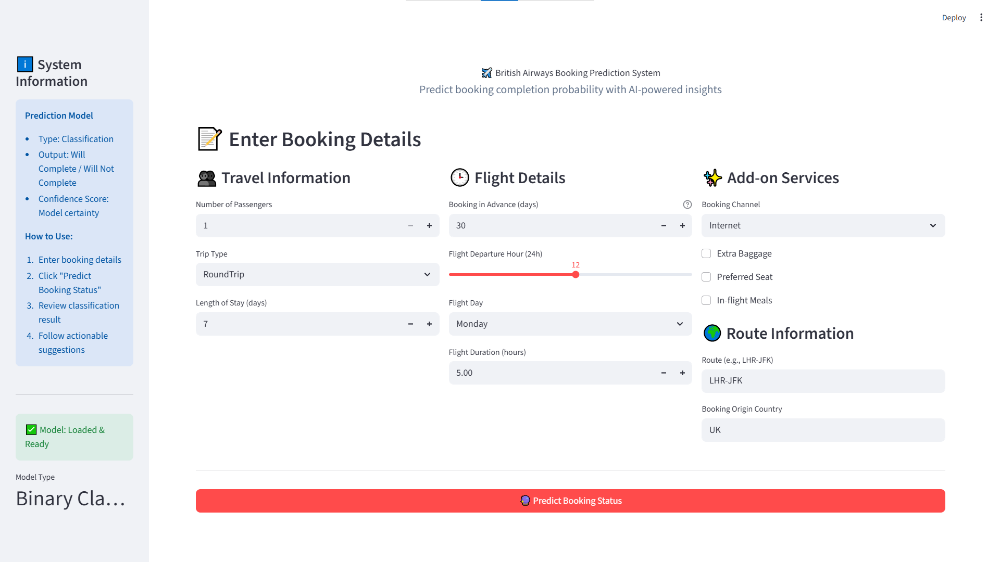
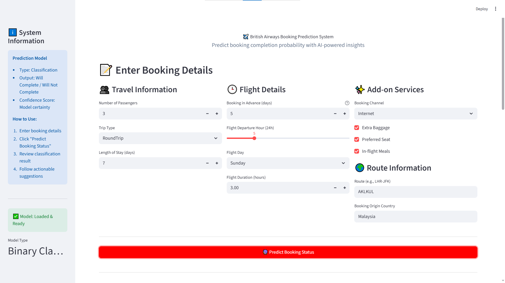
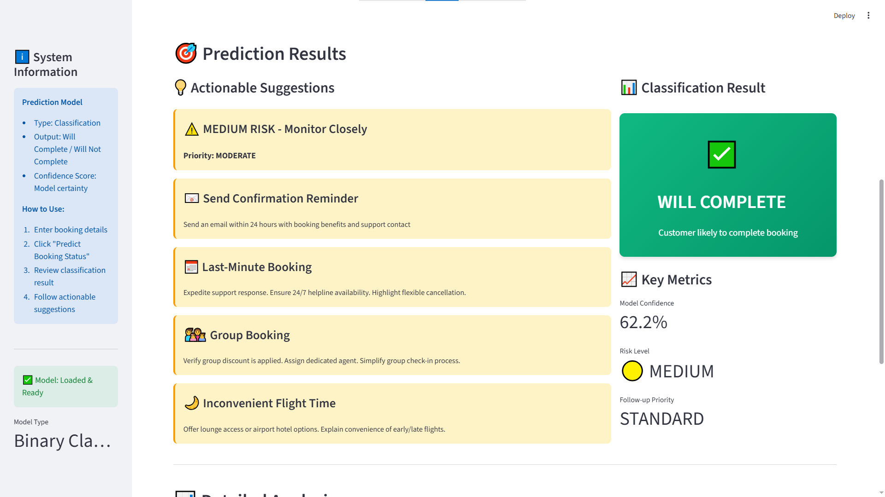
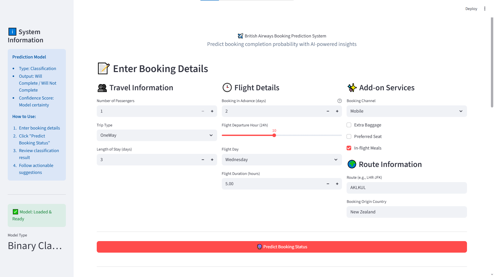
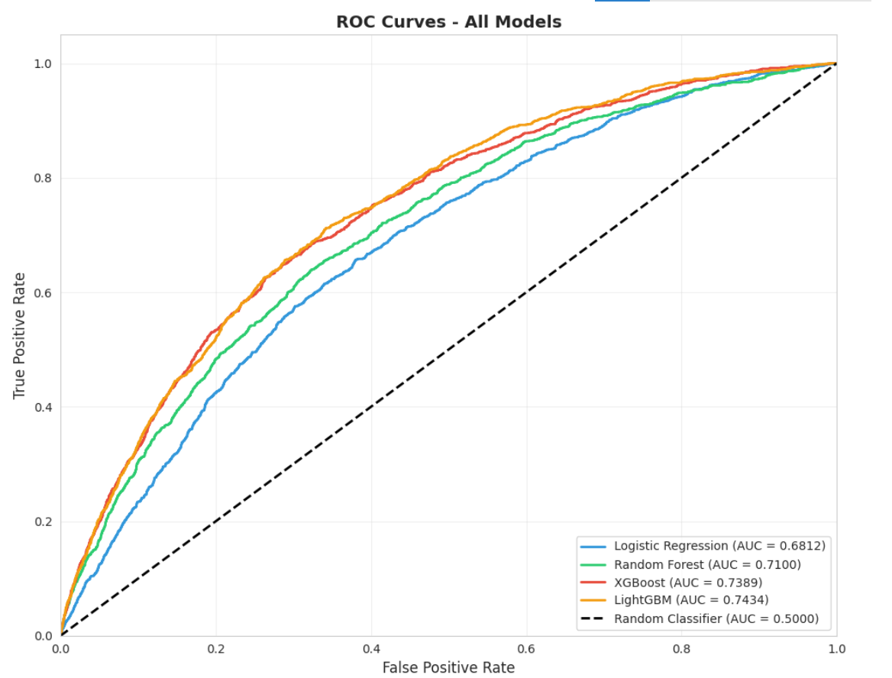
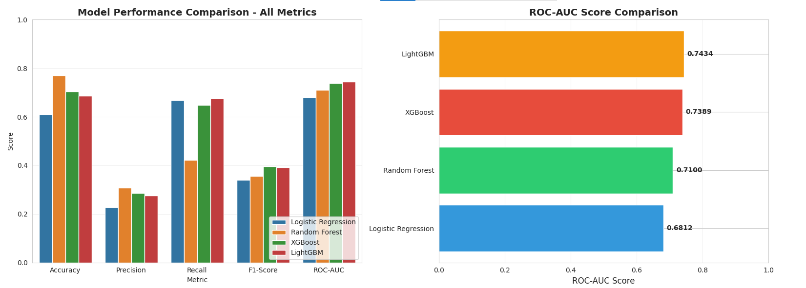
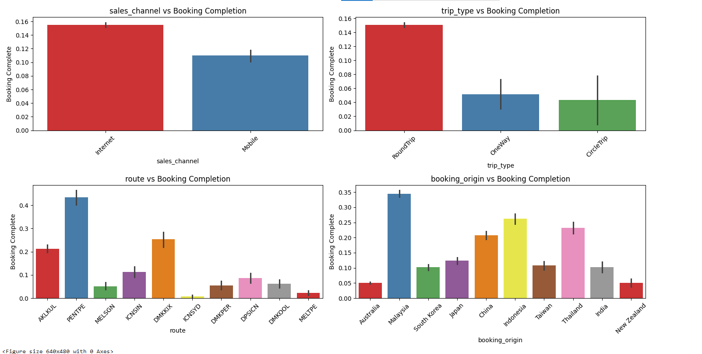
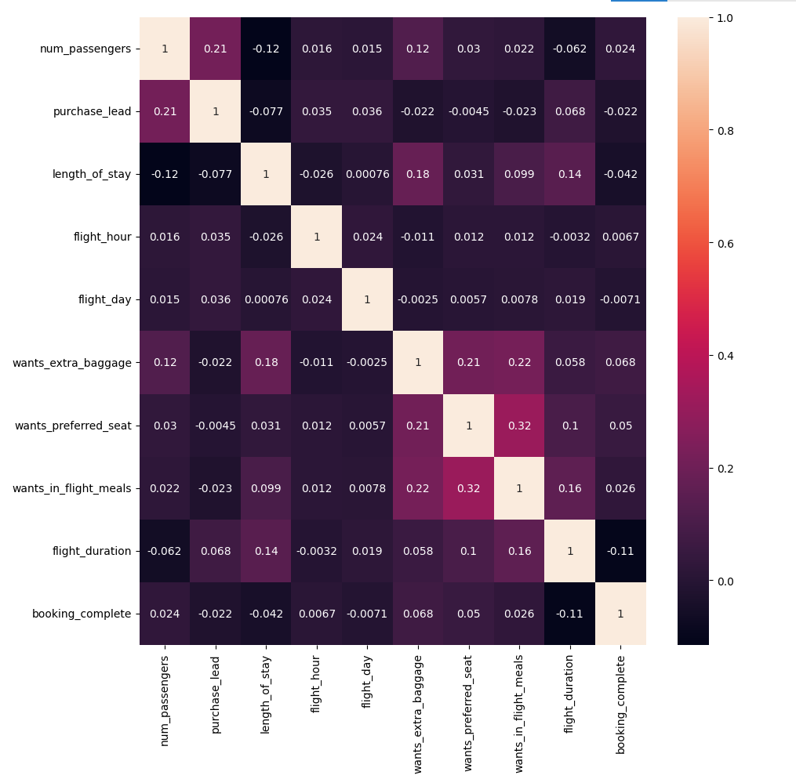

<h1 align="center">✈️ BRITISH AIRWAYS BOOKING COMPLETION PREDICTION</h1>

  
  
  
  

---

<h2>📘 Project Overview</h2>

This project predicts whether a <strong>flight booking will be completed or abandoned</strong> using British Airways customer booking data.
The goal is to understand <strong>customer intent and booking behavior</strong> and help airlines improve conversion rates through data-driven insights.

The project follows a complete <strong>end-to-end data science lifecycle</strong>:
Data preprocessing → Exploratory Data Analysis → Feature Engineering → Model Building → Evaluation.

---

<h2>🎯 Problem Statement</h2>

Airlines lose significant revenue due to incomplete bookings. Predicting booking completion enables:

<ul>
  <li>🎯 Early identification of high-risk abandonment cases</li>
  <li>🎁 Targeted discounts, reminders, or offers</li>
  <li>📈 Improved customer experience and booking conversion</li>
</ul>

---

<h2>✨ Key Features</h2>

<ul>
  <li>📊 Comprehensive <strong>Exploratory Data Analysis (EDA)</strong></li>
  <li>🧠 <strong>Feature Engineering</strong> based on customer behavior and trip characteristics</li>
  <li>⚖️ Proper handling of numerical and categorical variables</li>
  <li>🤖 Comparison of multiple <strong>classification models</strong></li>
  <li>🧠 Handling <strong>Imbalanced Dataset</strong></li>
  <li>📈 Evaluation using business-relevant metrics</li>
</ul>

---

<h2>🧩 Tech Stack</h2>

<table>
<tr>
  <td><strong>Language</strong></td>
  <td>Python 🐍</td>
</tr>
<tr>
  <td><strong>Libraries</strong></td>
  <td>pandas, numpy, matplotlib, seaborn</td>
</tr>
<tr>
  <td><strong>ML Framework</strong></td>
  <td>scikit-learn</td>
</tr>
<tr>
  <td><strong>Models Used</strong></td>
  <td>Logistic Regression, Random Forest, Gradient Boosting</td>
</tr>
<tr>
  <td><strong>Problem Type</strong></td>
  <td>Binary Classification</td>
</tr>
</table>

---

<h2>📊 Dataset Overview</h2>

<ul>
  <li><strong>Total Records:</strong> ~50,000</li>
  <li><strong>Total Features:</strong> 14</li>
  <li><strong>Target Variable:</strong> <code>booking_complete</code></li>
</ul>

The dataset includes:

<ul>
  <li>Number of passengers</li>
  <li>Purchase lead time</li>
  <li>Length of stay</li>
  <li>Flight hour and weekday</li>
  <li>Customer preferences (extra baggage, meals, preferred seat)</li>
  <li>Flight duration</li>
</ul>

---

<h2>📂 Project Structure</h2>

<pre>
📁 British-Airways-Booking-Prediction
│
├── notebooks/
│   ├── BA_Preprocessing_and_EDA.ipynb
│   ├── BA_Feature_Engineering.ipynb
│   └── BA_Model_building_and_Evaluation.ipynb
│
├── data/
│   └── booking_data.csv
│
├── models/
│   └── best_model.pkl
├── assets/
│   └── style.css
│
├── requirements.txt
├── British_Airways_Task_2.ppt
└── README.md
</pre>
---
<h2 align="center">🖥️ Application Interface & Model Visualizations</h2>

<!-- Row 1: Application Interface -->
<h3 align="center">🔹 Application Interface</h3>

  

---

<!-- Row 2: Prediction - Booking Completed -->
<h3 align="center">✅ Prediction: Booking Completed</h3>

  
  

---

<!-- Row 3: Prediction - Booking Not Completed -->
<h3 align="center">❌ Prediction: Booking Not Completed</h3>

  
  

---

<!-- Row 4: Model Performance -->
<h3 align="center">📈 Model Performance</h3>

  
  

---

<!-- Row 5: Exploratory Data Analysis -->
<h3 align="center">📊 Exploratory Data Analysis (EDA)</h3>

  
  

---

<h2>📈 Model Evaluation</h2>

<ul>
  <li>Confusion Matrix</li>
  <li>Accuracy, Precision, Recall, F1-score</li>
  <li>ROC-AUC Curve</li>
  <li>Business interpretation of False Positives & False Negatives</li>
</ul>

---

<h2>🧠 Skills Demonstrated</h2>

<ul>
  <li>Exploratory Data Analysis (EDA)</li>
  <li>Feature Engineering for tabular data</li>
  <li>Binary Classification Modeling</li>
  <li>Model Evaluation & Interpretation</li>
  <li>Business-oriented Data Science thinking</li>
</ul>

---

<h2>🚀 How to Run the Project</h2>

<ol>
  <li>Clone the repository:
    <pre><code>git clone https://github.com/yourusername/British-Airways-Booking-Prediction.git</code></pre>
  </li>
  <li>Create and activate a virtual environment:
    <pre><code>python -m venv venv
venv\Scripts\activate</code></pre>
  </li>
  <li>Install dependencies:
    <pre><code>pip install -r requirements.txt</code></pre>
  </li>
  <li>Run Streamlit:
    <pre><code>streamlit run app.py</code></pre>
  </li>
</ol>

---

<h2>💡 Business Impact</h2>

<ul>
  <li>📉 Reduced booking abandonment</li>
  <li>🎯 Better targeted customer engagement</li>
  <li>📊 Improved revenue forecasting</li>
  <li>✈️ Data-driven airline decision making</li>
</ul>

---

<h2>🤝 Collaboration</h2>

Contributions are welcome!

<ol>
  <li>Fork the repository 🍴</li>
  <li>Create a feature branch</li>
  <li>Commit your changes</li>
  <li>Open a Pull Request 🚀</li>
</ol>

---

<h2>🙏 Acknowledgements</h2>

<ul>
  <li>✈️ British Airways for guiding and provding job simulation</li>
  <li>🚀 Forage for providing platform</li>
  <li>📘 scikit-learn & Python ecosystem</li>
  <li>🧠 Data Science & ML community</li>
</ul>

---

<h3 align="center">⭐ If you like this project, give it a star on GitHub! ⭐</h3>

Made with ❤️ using Python & Machine Learning

